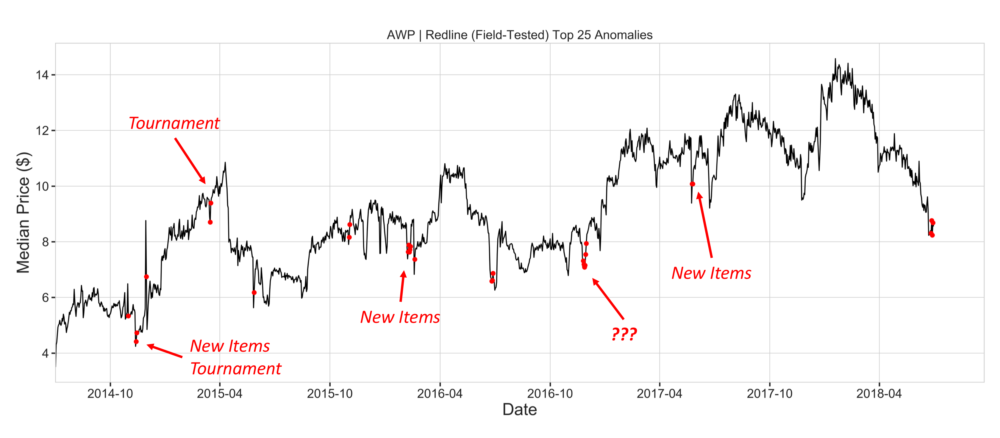

#  Market Anomaly Detection
[__Summer 2018 Galvanize Data Science Immersive__](https://www.galvanize.com/austin)

[See the video](https://youtu.be/1V9y67HRVrE) overview of this project.

The presentation can be viewed in [Google Slides](https://docs.google.com/presentation/d/12XAat28ZXKdyjs9xiH4Vvo63eOOn7Ir9VesQmASp_0Y/edit?usp=sharing).

---

[Steam](https://store.steampowered.com/) is the largest digital video game distribution platform. A subset of games on Steam include items that can be found in-game and sold to other players on [Steam's Community Market](https://steamcommunity.com/market/). My hypothesis was that significant events in the community (new item releases, big updates, tournaments, etc.) would affect the prices of these items. My goal was to detect anomalies in the market and investigate those dates to see if they did in fact correspond to events.


# Data Gathering

I wanted to gather all of the price history data for every item on the Steam Market pages.
<details><summary><i>(Show/hide market page example)</i></summary>

</details>

In the source code I was able to find the API the price history graphs were drawing from. To gather this data systematically, I needed the ID of the game and the name of the item for all 97,636 items I was after. I found a site [SteamApis](https://steamapis.com/) that had the names of every item for a given game. To get a list of every game that offered items on the Steam Market, I used BeautifulSoup to scrape a dropdown menu in the "Advanced Search" page of the market. With the list of game IDs, I was able to get a list of every item for each game from SteamAPIs, then use that list of items to get price history records from Steam. As the price history data came in, I saved it to a MongoDB with the following schema:
```
 item_name: string
 game: number
 prices: list
     date: string
     median_sell_price: number
     quantity: string
```
Where 'prices' had a {date, median_sell_price, quantity} entry for each daily record. I transfered the data I'd gathered into Pandas and created a Pickle to easily load the DataFrame without having to query Mongo.

# Exploration
After working with the data for a while, I learned that not all items were created equally. Some items had special properties (blue/red/green versions of the item) that were sold under the same name, for (sometimes) drastically different prices. I explored the economies of games and found that Counter-Strike: Global Offensive had the third most items, but the most number of transaction and the highest total value over the past year of data. Counter-Strike was not without the same issue, but those items were easily filtered out in this case. At this point I decided to just focus on Counter-Strike.

#### Fun facts about Counter-Strike: Global Offensive  
&nbsp;&nbsp;&nbsp;&nbsp;&nbsp;Between the time the first item was released and now (August 13, 2013 - June 30, 2018):
  * There are ~10,750 items on the market-place
  * The number of transactions between players is > 1.6B
  * The total amount of money traded between players is > 2.1B (estimated by quantity * median price per day)
  * Valve (the company that owns Steam and Counter-Strike) takes 15% of every transaction, earning them > $322.7M
  
# Features
There were many features I planned to use but did not have time to incorporate into my current model. They will be useful in my continued work when I update the ARIMA model to include more features or cluster items to run adjusted models on subsets of my data.

The features I used most frequently were:
```
  Item name / Description (concatenation of item name and release date for investigation purposes)
  Date of sale (Unix Time)
  Date of sale (Timestamp)
  Median sell price
  Quantity
  Minimum sell price
  Minimum quantity
  Estimated release date (by the first sale date for the item)
  Days since release
  ```

#### Datetimes


Woof. There sure are a lot of different (and frustratingly incompatible) formats that dates can appear in.
  * String
  * Datetime
  * pd.Timestamp
  * np.datetime64
  * Unix time (float)
  * DateTimeIndex
 
Some of these have underlying timezones associated with them. Sometimes it's GMT and sometimes it's the local timezone. My data was stored in a different format than ARIMA took, which was a different format than the anomaly detection function took. I created [`date_util.py`](date_util.py) to help convert between them, and prevent conversions between date formats from being the things that breaks me.

# Analysis


## The Plan
My plan was to run some kind of anomaly detection on every item's time series, aggregate the results, and categorize every date as anomalous or normal. Before I went too far, I wanted to make sure items actually did follow common trends, or have common anomalies. 


### Clustering

I performed heirarchical clustering and looked at examples of items that were clustered tightly. 

As you can see in this example of three items (with standardized mean and standard deviation), their prices move similarly, and price changes that look anomalous appear in the same places.

### Anomaly Detection
Many anomaly detection methods only find one anomalous point or rely on knowing the number of anomalies. Largely they use mean and standard deviation to find anomalies, which is inherantly problematic if the time series has many because the mean and standard deviation are sensitive to outliers. Twitter developed an anomaly detection algorithm that replaces mean and standard deviation with median and Median Absolute Deviation. This allows the algorithm to function consistently despite the number or severity of outliers.
Twitter's Anomaly Detection was originally written in R and ported to Python by Nicolas Steven Miller. The Python port is called [pyculiarity](https://github.com/mosho-p/pyculiarity). It was originally written for Python 2.7 and was not 100% up to date with Python 3.6, so I forked it and made the minor changes necessary.

### Filtering
There were a couple of factors that I had to take into account at this point as far as useful data.
  1. The minimum sale price for an item is $0.03 (1 cent to Steam, 1 cent to the game developer, and 1 cent to the seller), so if an item ever reached the minimum sell price, there would be no way for it to go lower and exhibit anomalies. I established a parameter to set the minimum threshold.
  2.  Almost universally, when items first come out they are far more expensive than they are a few days later. Part of what I wanted to investigate is whether new item releases affect the price of items that are already on the market. If the first several points in a time series are all marked as anomalies, my results will show new item releases as being anomalous whether they are or not, so I set up a parameter to removed the first _n_ days of sale.
  3. I had to take into account

### Twitter doesn't always work
This is a graph of a particularly bad example of the anomaly detection function in action. It failed to hit the big drop in price in the middle, and the sharp spike on the right.


[Pyramid]() is a Python port of a popular R function auto.arima. This allowed me to automatically fit the best ARIMA parameters to each time series, then run in-sample predictions. I used ARIMA for two reasons:
  1. Smooth each time series to avoid false positives
  2. Incorporate the `quantity` feature into the regression model

This is what anomaly detection resulted in after the time series was fit with ARIMA:


I gave each date an anomaly score of the number of items tagged with anomalies on that day divided by the number of items available on the market on that day. This score was the percent of items tagged with anomalies for each day. To do broad investigations of dates, I had a list of dates that the collections of items were released on[&sup1;] [&sup2;], dates of major tournaments[&sup3;], and a way to search the Counter Strike SubReddit by date range[&#8308;] to see if there were popular posts talking about big events.

[&sup1;]: http://p337.info/blog/csgo-case-release-order/
[&sup2;]: http://p337.info/blog/csgo-operation-release-order/
[&sup3;]: https://liquipedia.net/counterstrike/Majors#List_of_CS:GO_Major_Championships
[&#8308;]: http://redditsearch.io/?term=&dataviz=false&aggs=false&subreddits=globaloffensive&searchtype=posts&search=true&start=1534833735&end=1534920135&size=100

# Results


I investigated 25 dates with the highest anomaly score, and found that many of them occured with the release of new items. When I varied the parameters of the anomaly detection function, or minimum price/quantity/days on the market thresholds, many of the top anomalous dates changes, except anomalies in late November 2016 and late May 2017 seemed to show up every time. The anomalies in May 2017 corresponded with the release of new items, but I want to look more into it to see why it would be more prevalent than other release dates. It is not immediately obvious why anomalies consistantly show up in late November 2016, and I want to investigate that further.

This kind of information is useful for companies who rely on revenue from these items to be able to plan based on their estimated income, especially for games which are free-to-play like Team Fortress 2. Their revenue stream relies almost entirely around these items.

# Future Work
I plan to continue working on this project. The long term goal is to devise a way to automatically investigate dates that are scored highly using Natural Language Processing on a blog or forum. 

In the short term my plans are:
  * Investigate Nov 2016
  * Adjust parameters (auto.arima, anomaly detection, minimum price, minimum quantity, etc.)
  * Further work with clustering to see if I can define the tendencies of groups of items

---
# Resources
[Twitter Blog](https://blog.twitter.com/engineering/en_us/a/2015/introducing-practical-and-robust-anomaly-detection-in-a-time-series.html)
[Twitter AnomalyDetection](https://github.com/twitter/AnomalyDetection)

[Pyculiarity](https://github.com/mosho-p/pyculiarity): my fork of Nicolas Steven Miller's Python port of Twitter Anomaly Detection

[Pyramid](https://github.com/tgsmith61591/pyramid): Python port of R's auto.arima
